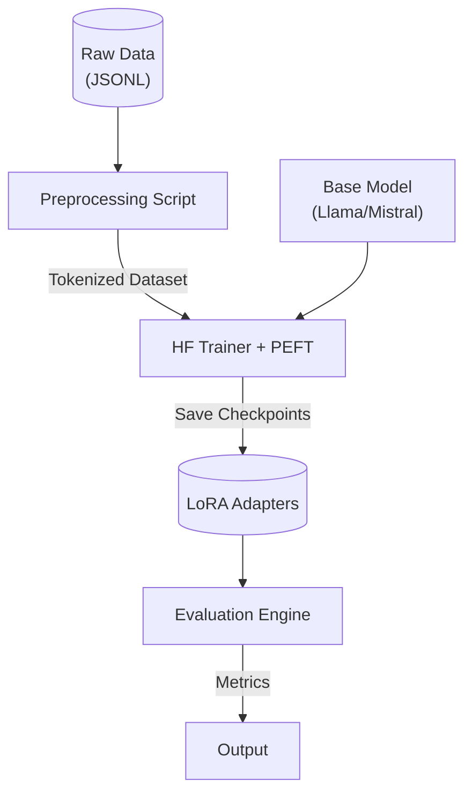

# Architecture — lora-finetuning-pipeline
> Last updated: 2026-08-29 | Maturity: Partial Prototype
> _PEFT/LoRA fine-tuning architecture._

## System Diagram

## Component Table
| Component | File | Responsibility | Tech |
|---|---|---|---|
| Trainer | `src/train.py` | Training loop | PyTorch / HF |
| Preprocessor | `src/data.py` | Tokenization | Transformers |
| Evaluator | `src/eval.py` | Cost & Quality metrics | Python |

## Dependency Honesty Table
| Dependency | Status | Notes |
|---|---|---|
| GPU Accelerators | **Mocked** | CI uses CPU tensors. Real runs require manual deployment to a GPU box. |

## Component Breakdown
- **Core Technology**: Python, Hugging Face, Unsloth, W&B
- **Design Paradigm**: Emphasizes high availability, fault tolerance, and security.