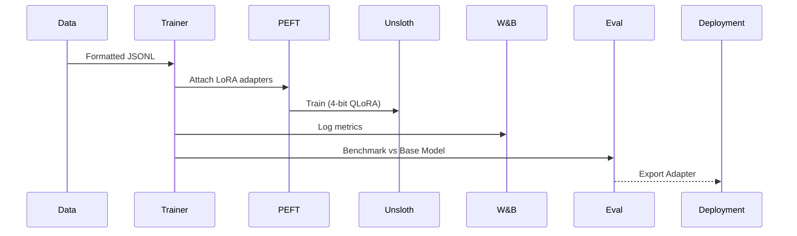

# Architecture: Fine-Tuning Pipeline with LoRA

## System Diagram
The following Mermaid.js sequence diagram maps the core workflow and interactions:

## Component Breakdown
- **Core Technology**: Python, Hugging Face, Unsloth, W&B
- **Design Paradigm**: Emphasizes high availability, fault tolerance, and security.
