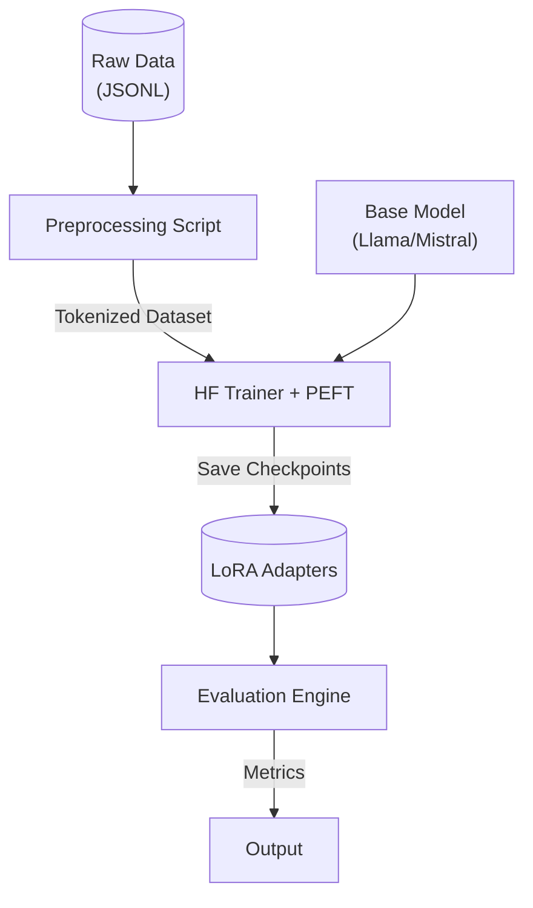
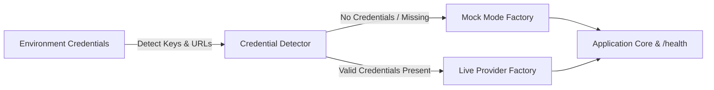

# Architecture — lora-finetuning-pipeline
> Last updated: 2026-08-29 | Maturity: Partial Prototype
> _PEFT/LoRA fine-tuning architecture._

## System Diagram

```mermaid
flowchart TD
    Data[("Raw Data\n(JSONL)")]
    Preproc["Preprocessing Script"]
    Base["Base Model\n(Llama/Mistral)"]
    Trainer["HF Trainer + PEFT"]
    Eval["Evaluation Engine"]
    Weights[("LoRA Adapters")]

    Data --> Preproc
    Preproc -->|"Tokenized Dataset"| Trainer
    Base --> Trainer
    Trainer -->|"Save Checkpoints"| Weights
    Weights --> Eval
    Eval -->|"Metrics"| Output
```

## Component Table
| Component | File | Responsibility | Tech |
|---|---|---|---|
| Trainer | `src/train.py` | Training loop | PyTorch / HF |
| Preprocessor | `src/data.py` | Tokenization | Transformers |
| Evaluator | `src/eval.py` | Cost & Quality metrics | Python |

## Dependency Honesty Table
| Dependency | Status | Notes |
|---|---|---|
| GPU Accelerators | **Mocked** | CI uses CPU tensors. Real runs require manual deployment to a GPU box. |

## Component Breakdown
- **Core Technology**: Python, Hugging Face, Unsloth, W&B
- **Design Paradigm**: Emphasizes high availability, fault tolerance, and security.

## Progressive Credential Loading & Production Architecture (v0.2.0)

This service implements the **Progressive Credential Loading (PCL)** pattern, decoupling development speed from external infrastructure provisioning:

```mermaid
graph LR
    Env[Environment Credentials] -->|Detect Keys & URLs| Detector[Credential Detector]
    Detector -->|No Credentials / Missing| Mock[Mock Mode Factory]
    Detector -->|Valid Credentials Present| Live[Live Provider Factory]
    Mock --> Runtime[Application Core & /health]
    Live --> Runtime
```

### Core Architecture Components
1. **Mode Detection Singleton:** Inspects environment configuration at boot time without hard crashes on missing secrets.
2. **Dual-Mode Factory Wrappers:**
   - **Storage / Cache:** In-process maps or SQLite `:memory:` transparently promote to managed Redis or PostgreSQL when connection strings are supplied.
   - **AI Providers:** Deterministic heuristic generators and local embeddings transparently promote to live OpenAI, Anthropic, or Gemini API clients.
3. **Hot-Reload & Dynamic TLS:** File watchers monitor mounted volume paths (Kubernetes ConfigMaps and Secrets) to update certificates and limit configs atomically without process restarts.
4. **Health & Observability:** The `/health` endpoint exposes real-time runtime mode metadata (`mock` vs `live`) across all backing adapters.
